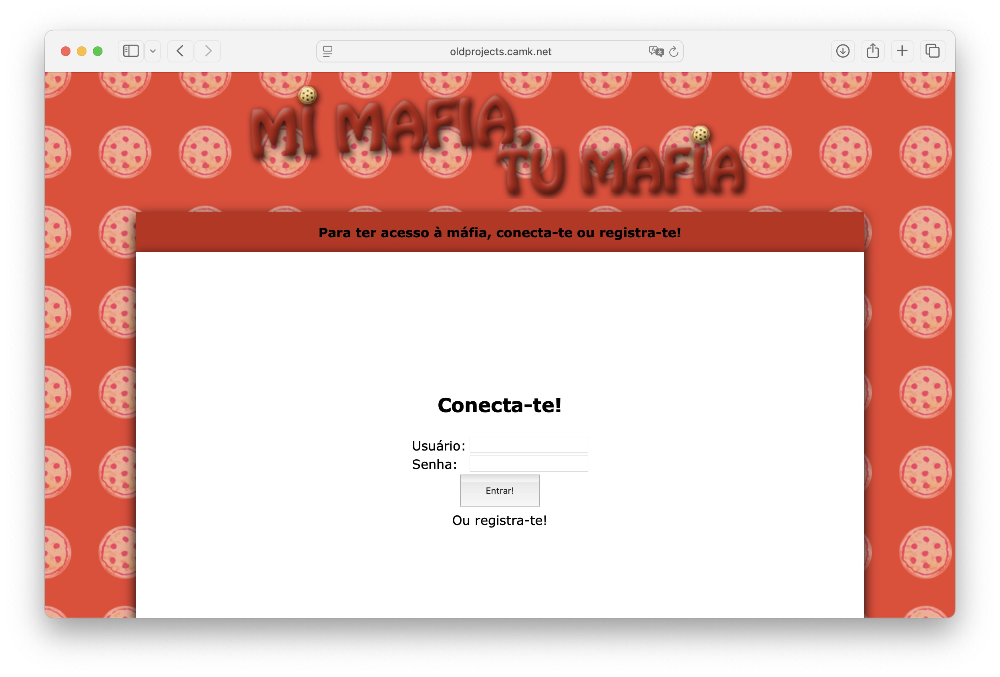
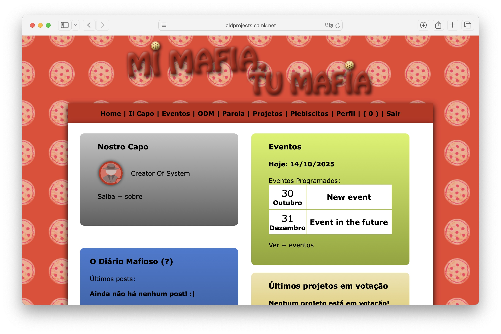
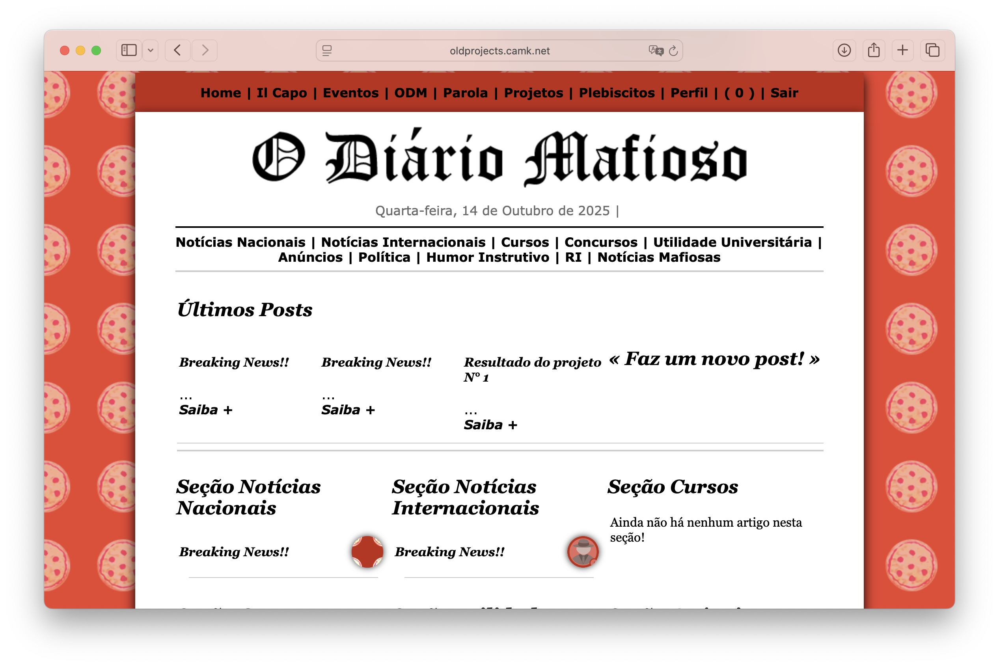
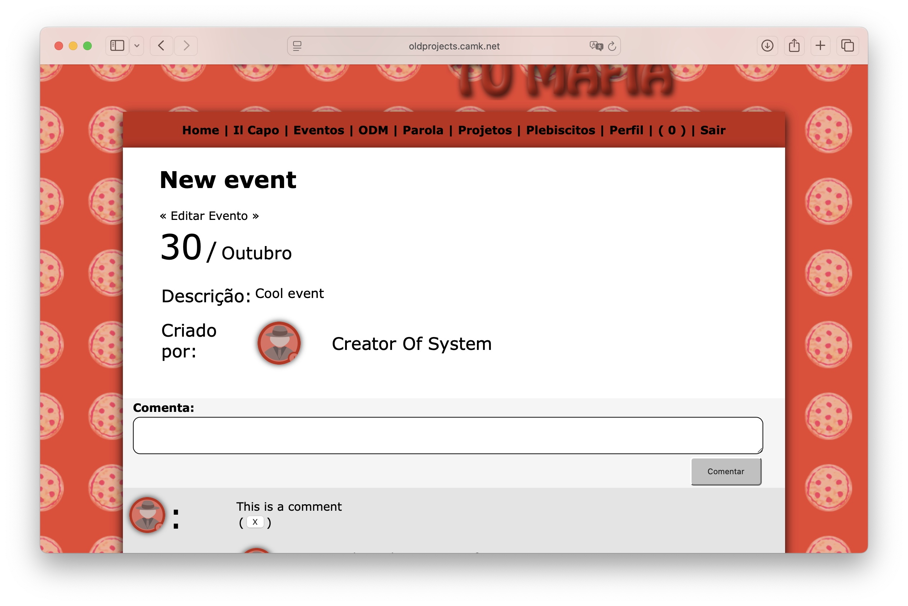
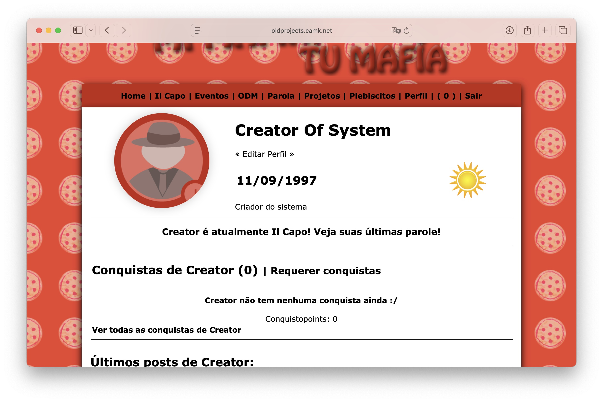

# 🇮🇹 "_Mi Mafia, tu mafia_" – University Social Network (2014)

**🗂️ Archival project from April 2014**  
**Frontend:** jQuery 1.7.2 · HTML · CSS  
**Backend:** PHP (updated to modern version with mysqli and security improvements)  
**License:** Apache 2.0  
**Live demo:** [Open it here](https://oldprojects.camk.net/organisationsocialnetwork_2014) (more info on how to access below) 

---

## 💬 About the Project

When I started my bachelor's in **International Relations** in 2014, I created a group with my new colleagues called **"_Mi Mafia_"**.  
We were a lively bunch, passionate about politics, debate, and socialising. So I decided to build us our own **social network**:  
👉 *Mi Mafia, tu mafia.*

This system became our **private online hub**, where we could elect our "_Capo_" (leader), publish news, propose projects, and programme events, all within our own playful *mafia-inspired* structure.  

---

## 🧩 Features Overview

### 👥 User Registration & Profiles
- Registration required a valid university ID pre-registered in the system.  
- User profiles included:
  - Photo, name, birthdate, bio, and study period (morning/afternoon/evening).  
  - Articles written for the group's newspaper (_O Diário Mafioso_).  
  - Earned badges and achievements.

### 🗳️ Monthly Elections
- Every month, members could **run for Capo** (leader of _Mi Mafia_).  
- All users could vote, and results were automatically tallied by the system.

### 📰 “_O Diário Mafioso_” — The Digital Newspaper
- Users could write and publish articles across various categories:
  - Notícias Nacionais (national news)
  - Notícias Internacionais (international news)
  - Cursos (courses)
  - Concursos (public tenders)
  - Utilidade Universitária (university life)
  - Anúncios (ads)
  - Política (politics)  
  - Humor Instrutivo (instructive humour)
  - Relações Internacionais (Int'l Relations)
  - Notícias Mafiosas (group's own news)
- Articles displayed author info and allowed comments from other users.
- Articles could be up or downvoted (from 10 downvotes onwards, the article could be made invisible by the Capo)

### 📅 Events
- Users could **create events**, with comments and notifications for attendees.

### 🧱 Projects & Plebiscites
- Members could propose **projects** for the group and vote on them.  
- The **Capo** reviewed and approved or rejected approved proposals.  
- The Capo could also issue **plebiscites** (e.g., to expand the group).

### 📣 Capo “_Parola_” System
- The Capo could issue short *parole* (max 100 characters), public statements visible to all.  
- New parole triggered notifications across all user dashboards.

### 🏅 Badges & Rewards
- Users earned badges for:
  - Creating or attending events.  
  - Publishing articles.  
  - Participating in elections.
- Users would earn "_Conquistopoints_" (awardpoints) for each badge earned.
- Badges appeared on user profiles and reflected engagement.

### 🔔 Notifications System
- Real-time notification counter for:
  - New parole from the Capo.  
  - New articles, comments, or events.  
  - Projects, elections, and plebiscites.

---

## 🖼️ Suggested Screenshots

## 📸 Screenshots

| Screenshot | Description |
|-------------|--------------|
|  | **Login Page** – Entry point of the system where users log in using their account or register using the pre-registered *matrícula* (university ID). |
|  | **Dashboard** – The main feed showing parole from the Capo, recent articles, events, and notifications. |
|  | **O Diário Mafioso** – The internal newspaper where users can read and post articles under different categories. |
|  | **Event Page** – Displays event details and comments. Users can create and participate in events. |
|  | **User Profile** – Shows user information, photo, bio, badges, and their published articles. |

---

## 🧠 Technical Notes
- Originally built in **April 2014** using PHP 5.x and MySQL.  
- **Fully updated** for PHP 8.2 with `mysqli` and modern security practices.  
- Interactivity handled with **jQuery 1.7.2** and vanilla JavaScript.  
- Designed primarily for desktop browsers of the early 2010s.

---

## 🎲 Live demo

I have made a live demo available where you can access the system. Just access the [link here](https://oldprojects.camk.net/organisationsocialnetwork_2014) and use the following username: "creator_system" and password: "123456789". This account is "il capo". You can also try a "normal" account with: "testa_italiana" and password "123456789".

---

## 🚀 Why I Keep It Here

This project marks the **beginning of my journey as a developer** — where creativity, humour, and a touch of political flair met code.  
It's a nostalgic example of how even small, student-driven communities can inspire full digital ecosystems.

---

## 🎩 Fun Facts

- The Capo was **elected democratically every month** — complete with campaigns and all! 🗳️  
- Some users actually **wrote columns** for *O Diário Mafioso*, treating it like a real newsroom.  
- “Mi Mafia” even issued **plebiscites** to decide who could join (or be expelled from!) our group. Bureaucracy meets friendship! 🇮🇹  

---

## 🧾 License
This project is open under the **Apache License 2.0**.  
You’re welcome to explore, adapt, or draw inspiration — just provide proper attribution.

You can clone the repository to your local machine and run it! The database is included and you just have to change the "conectar.php" file with your local data.

---

To see more live demos of old projects, click here:

---

**© 2014–2025 – Created and updated by Caio Ponce de Leon** 
